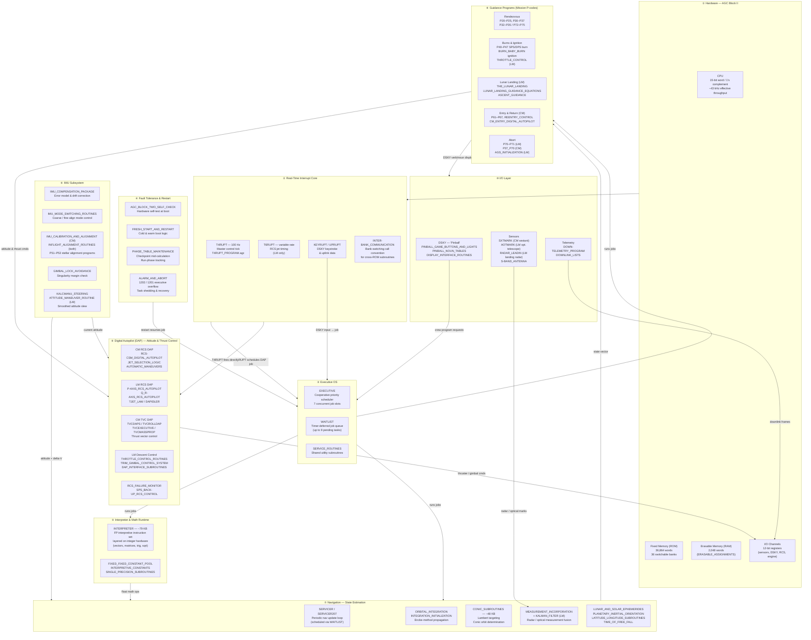

# Rewriting Apollo 11 AGC in Rust

A guide for reimplementing the Apollo 11 Guidance Computer software in Rust.

## Source Repository Reference

**[https://github.com/chrislgarry/Apollo-11](https://github.com/chrislgarry/Apollo-11)**

Original AGC source code digitized from MIT Museum hardcopies (Paul Fjeld / Deborah Douglas).  
64.9k stars · 7.4k forks · 208 contributors · Active as of 2026 · License: Public Domain

### Repository Layout

```
Apollo-11/
├── Comanche055/   # Command Module (CM) — Colossus 2A, rev 055, assembled 1 Apr 1969
└── Luminary099/   # Lunar Module (LM) — Luminary 1A, rev 001, assembled 14 Jul 1969
```

Each directory contains ~70–80 `.agc` source files assembled with **yaYUL**.

---

### Comanche055 — Command Module Key Files

| File | Purpose |
|---|---|
| `MAIN.agc` | Top-level include / entry point |
| `EXECUTIVE.agc` | Priority scheduler (cooperative multitasking) |
| `WAITLIST.agc` | Deferred task queue |
| `INTERPRETER.agc` | ~79 KB — interpretive floating-point language on integer hardware |
| `ERASABLE_ASSIGNMENTS.agc` | ~102 KB — all RAM variable declarations |
| `FRESH_START_AND_RESTART.agc` | Cold start + restart recovery |
| `PHASE_TABLE_MAINTENANCE.agc` | Restart checkpoint tables |
| `ALARM_AND_ABORT.agc` | Fault handling |
| `INTERRUPT_LEAD_INS.agc` | Interrupt vector dispatch |
| `T4RUPT_PROGRAM.agc` | ~38 KB — 100 Hz timer interrupt (main control loop) |
| `PINBALL_GAME_BUTTONS_AND_LIGHTS.agc` | ~100 KB — entire DSKY UI handler |
| `PINBALL_NOUN_TABLES.agc` | DSKY noun/verb display tables |
| `DISPLAY_INTERFACE_ROUTINES.agc` | ~40 KB — display driver |
| `CONIC_SUBROUTINES.agc` | ~47 KB — orbital mechanics (conics, Lambert) |
| `ORBITAL_INTEGRATION.agc` | Trajectory propagation |
| `IMU_MODE_SWITCHING_ROUTINES.agc` | Inertial measurement unit control |
| `IMU_COMPENSATION_PACKAGE.agc` | IMU error correction |
| `IMU_CALIBRATION_AND_ALIGNMENT.agc` | IMU alignment procedures |
| `INFLIGHT_ALIGNMENT_ROUTINES.agc` | Mid-flight IMU realignment |
| `KALCMANU_STEERING.agc` | Attitude maneuver steering |
| `GIMBAL_LOCK_AVOIDANCE.agc` | Singularity prevention |
| `RCS-CSM_DIGITAL_AUTOPILOT.agc` | Reaction control autopilot |
| `CM_ENTRY_DIGITAL_AUTOPILOT.agc` | ~31 KB — reentry autopilot |
| `REENTRY_CONTROL.agc` | ~32 KB — reentry guidance |
| `JET_SELECTION_LOGIC.agc` | RCS thruster selection |
| `P11.agc` | P11 — Earth orbit insertion |
| `P20-P25.agc` | ~71 KB — Rendezvous navigation programs |
| `P37_P70.agc` | ~38 KB — Return-to-Earth / abort |
| `P40-P47.agc` | ~51 KB — SPS engine burn programs |
| `P51-P53.agc` | ~41 KB — IMU orientation programs |
| `INTEGRATION_INITIALIZATION.agc` | State vector initialization |
| `DOWN-TELEMETRY_PROGRAM.agc` | Telemetry downlink |
| `SERVICER207.agc` | Navigation servicer (state update loop) |
| `MEASUREMENT_INCORPORATION.agc` | Kalman filter measurement update |
| `TIME_OF_FREE_FALL.agc` | Free-fall/ coasting trajectory |
| `INTER-BANK_COMMUNICATION.agc` | Cross-bank subroutine calls |
| `SINGLE_PRECISION_SUBROUTINES.agc` | Basic math utilities |
| `CONTRACT_AND_APPROVALS.agc` | Program signatures (Margaret H. Hamilton et al.) |

---

### Luminary099 — Lunar Module Key Files

| File | Purpose |
|---|---|
| `MAIN.agc` | Top-level include / entry point |
| `EXECUTIVE.agc` | Priority scheduler |
| `WAITLIST.agc` | Deferred task queue |
| `INTERPRETER.agc` | ~79 KB — interpretive language (same design as CM) |
| `ERASABLE_ASSIGNMENTS.agc` | ~78 KB — RAM variables |
| `FRESH_START_AND_RESTART.agc` | Cold start + restart |
| `THE_LUNAR_LANDING.agc` | High-level landing sequence logic |
| `LUNAR_LANDING_GUIDANCE_EQUATIONS.agc` | Core powered-descent guidance |
| `ASCENT_GUIDANCE.agc` | Ascent phase guidance |
| `BURN_BABY_BURN--MASTER_IGNITION_ROUTINE.agc` | Engine ignition sequencer |
| `P-AXIS_RCS_AUTOPILOT.agc` | ~21 KB — pitch-axis RCS autopilot |
| `Q_R-AXIS_RCS_AUTOPILOT.agc` | ~17 KB — yaw/roll-axis RCS autopilot |
| `DAPIDLER_PROGRAM.agc` | Digital autopilot idle mode |
| `TJET_LAW.agc` | ~17 KB — thruster jet firing law |
| `THROTTLE_CONTROL_ROUTINES.agc` | DPS throttle control |
| `TRIM_GIMBAL_CONTROL_SYSTEM.agc` | Engine gimbal trim |
| `T4RUPT_PROGRAM.agc` | ~37 KB — 100 Hz timer interrupt |
| `T6-RUPT_PROGRAMS.agc` | TIME6 interrupt (RCS firing) |
| `CONIC_SUBROUTINES.agc` | ~48 KB — orbital mechanics |
| `ORBITAL_INTEGRATION.agc` | Trajectory propagation |
| `KALMAN_FILTER.agc` | Navigation filter |
| `MEASUREMENT_INCORPORATION.agc` | Filter measurement update |
| `IMU_MODE_SWITCHING_ROUTINES.agc` | IMU control |
| `IMU_COMPENSATION_PACKAGE.agc` | IMU error model |
| `AGS_INITIALIZATION.agc` | Abort Guidance System init |
| `AOSTASK_AND_AOSJOB.agc` | ~29 KB — abort orbiting sequence |
| `AOTMARK.agc` | ~17 KB — Alignment Optical Telescope marking |
| `P20-P25.agc` | ~121 KB — Rendezvous programs (largest LM file) |
| `P40-P47.agc` | DPS burn programs |
| `P51-P53.agc` | IMU orientation programs |
| `P70-P71.agc` | Abort programs (famous 1202/1201 alarm context) |
| `LANDING_ANALOG_DISPLAYS.agc` | Landing radar analog display |
| `RADAR_LEADIN_ROUTINES.agc` | Landing/rendezvous radar init |
| `RCS_FAILURE_MONITOR.agc` | Thruster failure detection |
| `SPS_BACK-UP_RCS_CONTROL.agc` | RCS backup for SPS fails |
| `INPUT_OUTPUT_CHANNEL_BIT_DESCRIPTIONS.agc` | I/O channel register map |
| `DOWN_TELEMETRY_PROGRAM.agc` | Telemetry downlink |
| `AGC_BLOCK_TWO_SELF_CHECK.agc` | Hardware self-test at startup |
| `GIMBAL_LOCK_AVOIDANCE.agc` | Singularity prevention |
| `INTER-BANK_COMMUNICATION.agc` | Cross-bank calls |
| `GENERAL_LAMBERT_AIMPOINT_GUIDANCE.agc` | Lambert targeting |
| `STABLE_ORBIT.agc` | Stable orbit hold mode |
| `SERVICER.agc` | ~35 KB — navigation servicer |
| `INTEGRATION_INITIALIZATION.agc` | State vector init |

---

### Engineering Patterns Observed in the Source

**1. Cooperative multitasking under extreme constraints**
The `EXECUTIVE` + `WAITLIST` pair implements a lightweight cooperative scheduler with priority levels, fitting in a 4 KB RAM / 72 KB ROM envelope. No OS, no heap — all job slots are statically allocated.

**2. Restart protection via phase tables**
`PHASE_TABLE_MAINTENANCE.agc` tracks which phase of a long computation is in progress. On restart, the program re-enters at the last reliable checkpoint. This is an early form of persisted execution state — analogous to modern saga/workflow patterns.

**3. Interpretive language as a portability/power layer**
`INTERPRETER.agc` implements a complete floating-point interpretive instruction set on top of the 15-bit integer AGC hardware. Programs like `CONIC_SUBROUTINES.agc` run in this interpreter for complex math. This dual-mode design (basic assembly + interpreted) mirrors modern VM-on-hardware designs.

**4. Banked memory calls**
The AGC ROM was split into fixed/switchable banks. `INTER-BANK_COMMUNICATION.agc` provides the calling convention for cross-bank subroutines — critical to correctly emulate when translating to Rust modules.

**5. 1202/1201 alarm handling**
The famous executive overflow alarms during lunar landing are handled in `ALARM_AND_ABORT.agc`. The computer shed lower-priority tasks and recovered — a real-time priority inversion solution from 1969.

**6. The DSKY "Pinball" interface**
`PINBALL_GAME_BUTTONS_AND_LIGHTS.agc` (~100 KB) is the largest single source file in Comanche and handles all verb/noun/program display logic. The informal name "Pinball" was the MIT engineers' own nickname for the display driver.

---

## AGC Software Architecture

The architecture is revealed directly by the `MAIN.agc` include order, which acts as a link script: it defines the physical ROM layout and thus the intended dependency graph. Nine layers are identifiable from top to bottom.



### How the Layers Interact

| Signal / Event | Source | Flows Through | Destination |
|---|---|---|---|
| 100 Hz tick | T4RUPT | — | T4RUPT handler → schedules DAP job via EXEC |
| Nav state update | WAITLIST timer | EXECUTIVE → SERVICER → ORBITAL_INTEGRATION | State vector (RAM) |
| Crew VERB/NOUN | KEYRUPT → DSKY | PINBALL → EXECUTIVE | Guidance P-program job |
| Guidance command | P-code (e.g. P63) | EXECUTIVE → LUNAR_LANDING_GUIDANCE | DAP attitude/thrust target |
| Attitude error | DAP | IMU delta-angle registers | RCS/TVC actuator channels |
| Kalman update | Radar mark | MEASUREMENT_INCORPORATION → KALMAN_FILTER | State vector correction |
| 1202 alarm | EXECUTIVE overflow | ALARM_AND_ABORT | Shed low-priority jobs, continue |
| Warm restart | Power glitch / alarm | FRESH_START → PHASE_TABLE | Re-enter mid-calculation |
| Telemetry frame | Every cycle | DOWNLINK_LISTS → DOWN-TELEMETRY | I/O channel to S-band |

### T4RUPT — The Heartbeat

Every 10 ms the T4RUPT interrupt fires and drives the entire system:

```
T4RUPT (100 Hz)
 ├── Sample IMU (delta-angle, delta-velocity registers)
 ├── Update DAP error signals → compute RCS/TVC commands
 ├── Dispatch thruster fire pulses (T6RUPT on LM)
 ├── Service DSKY display refresh
 └── Return to EXECUTIVE / WAITLIST round-robin
```

The EXECUTIVE then runs whichever guidance job has the highest priority (navigation servicer, active P-program, or DSKY handler).

---

## Core Knowledge Required (MVP)

- **15-bit word, 1's complement** — not standard two's complement; all arithmetic is scaled fixed-point
- **Fixed and erasable memory** (ROM 36 KB / RAM 2 KB) — no heap; all state is statically allocated
- **Cooperative multitasking** — EXECUTIVE runs the highest-priority ready job; jobs yield voluntarily
- **WAITLIST** — timer-deferred job queue (up to 9 pending); the scheduler re-enqueues jobs on expiry
- **Restart protection** — PHASE_TABLE_MAINTENANCE checkpoints long calculations; on restart the job re-enters at the last saved phase

## Recommended Rust Ecosystem (MVP)

- `heapless` — `no_std` fixed-capacity collections (job queue, WAITLIST ring)
- `fixed` — fixed-point arithmetic matching AGC scaled integers
- `bitflags` — hardware register / I/O channel modelling
- `proptest` — property-based tests for scheduler invariants
- `cargo-nextest`, `cargo-clippy`, `cargo-audit` — CI hygiene

## Architecture Decisions

**Reimplementation, not emulation.** The goal is idiomatic Rust that captures the same scheduler semantics, not a cycle-accurate AGC binary runner. This keeps the code readable for the methodology presentation and portable to `no_std` targets.

Single crate for MVP: `agc-executive`. Split into sub-crates only if compile times or module boundaries warrant it after the EXECUTIVE + WAITLIST are working.

## Suggested Approach

### Phase 1: Core Infrastructure

1. AGC memory model and instruction decoder
2. Basic instruction execution engine
3. Interpretive language subset

**Deliverable**: Simple program executes basic math operations

### Phase 2: Navigation Foundation

1. State vector propagation (Encke method like AGC)
2. Coordinate transformations
3. IMU integration

**Deliverable**: Orbital propagator matches known test cases

## Learning Resources

### Existing Rust Implementations

- `felipevb/ragc` - Study their emulator approach
- `K0R0VA/apollo-gateway-rs` - See architectural decisions

### Essential References

- **Virtual AGC project** (virtualagc.org) - Deep technical documentation
  - AGC assembly language reference
  - Hardware specifications
  - Original MIT documentation
  
- **Apollo 11 Flight Journal** - Mission timeline and guidance mode usage
  - When each program (P-code) was used
  - Actual telemetry data
  
- **MIT IL reports** - Original AGC design documents
  - R-567: AGC4 Basic Training Manual
  - E-2052: Guidance System Operations Plan
  
- **"Digital Apollo"** by David Mindell - Historical context
  - Design decisions and trade-offs
  - Human-computer interaction philosophy

### Technical Papers

- "Apollo Guidance Computer Architecture and Operation" - Eldon C. Hall
- "The Apollo Guidance Computer: Architecture and Operation" - Frank O'Brien
- NASA Technical Reports on Kalman filtering and guidance equations

## Validation Strategy (MVP)

All validation targets the EXECUTIVE + WAITLIST scheduler behaviour:

```rust
#[cfg(test)]
mod tests {
    #[test] fn highest_priority_job_runs_first() {}
    #[test] fn job_slots_exhausted_triggers_alarm() {}
    #[test] fn waitlist_fires_after_delta_t() {}
    #[test] fn completed_job_frees_slot() {}
    #[test] fn restart_resumes_at_saved_phase() {}
}
```

If a navigation component (`SERVICER`, `ORBITAL_INTEGRATION`, or `CONIC_SUBROUTINES`) is added in Phase 2, compare its output against the Virtual AGC emulator for the same input state.


## Implementation Considerations

### Memory Management

The AGC had strict memory constraints:
- 2048 words erasable memory (RAM)
- 36,864 words fixed memory (ROM)

Consider using:
```rust
const ERASABLE_SIZE: usize = 2048;
const FIXED_SIZE: usize = 36864;

struct Memory {
    erasable: [u16; ERASABLE_SIZE],
    fixed: [u16; FIXED_SIZE],
}
```

### Fixed-Point Arithmetic

AGC used scaled integers for all calculations:
```rust
// Example: Represent velocities in meters/second scaled by 2^7
#[derive(Clone, Copy)]
struct Velocity(i32); // Internal scaling: 1 unit = 1/128 m/s

impl Velocity {
    fn from_mps(mps: f64) -> Self {
        Self((mps * 128.0) as i32)
    }
    
    fn to_mps(self) -> f64 {
        self.0 as f64 / 128.0
    }
}
```

### Interrupt Handling

AGC had 11 interrupt vectors with priorities:
```rust
enum Interrupt {
    T6RUPT,  // TIME6 overflow
    T5RUPT,  // TIME5 overflow
    T3RUPT,  // TIME3 overflow
    T4RUPT,  // TIME4 overflow
    KEYRUPT, // Keyboard
    UPRUPT,  // Uplink
    // ...
}

impl AGC {
    fn service_interrupts(&mut self) {
        // Handle by priority
    }
}
```

## Milestones

### Milestone 1: EXECUTIVE + WAITLIST (MVP)
- [ ] Crate scaffold (`agc-executive`, `no_std`-ready)
- [ ] Static job table (7 slots), priority ordering
- [ ] `STARTJOB` / `ENDJOB` API
- [ ] WAITLIST timer queue (up to 9 pending tasks)
- [ ] Phase-table restart protection (5 phases)
- [ ] All scheduler unit tests pass

### Milestone 2: One Navigation Component (optional)
- [ ] Choose one: `SERVICER`, `ORBITAL_INTEGRATION`, or `CONIC_SUBROUTINES`
- [ ] Spec file written and reviewed
- [ ] Implementation driven by EXECUTIVE scheduler
- [ ] Output matches Virtual AGC emulator for same input state
